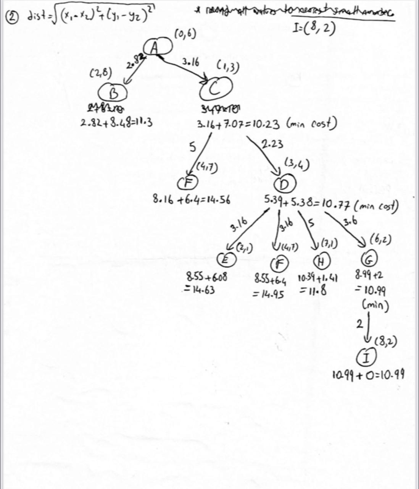

# A* Algorithm Implementation

## Overview
Implementation of the A* pathfinding algorithm to find the shortest path from node A to node I.

## Formula
f(n) = g(n) + h(n)
g(n) = Actual cost from start to current node

h(n) = Heuristic distance from current node to goal (Euclidean distance)

f(n) = Total estimated cost

## Graph


## Nodes and Coordinates
- A (0, 6) - Start
- B (2, 8)
- C (1, 3)
- D (3, 4)
- E (2, 1)
- F (4, 7)
- G (6, 2)
- H (7, 1)
- I (8, 2) - Goal

## Optimal Path
A → C → D → G → I

Total Cost: 10.99

## How to Run
```bash
python a_star.py
```

## Author
Saja Barake
